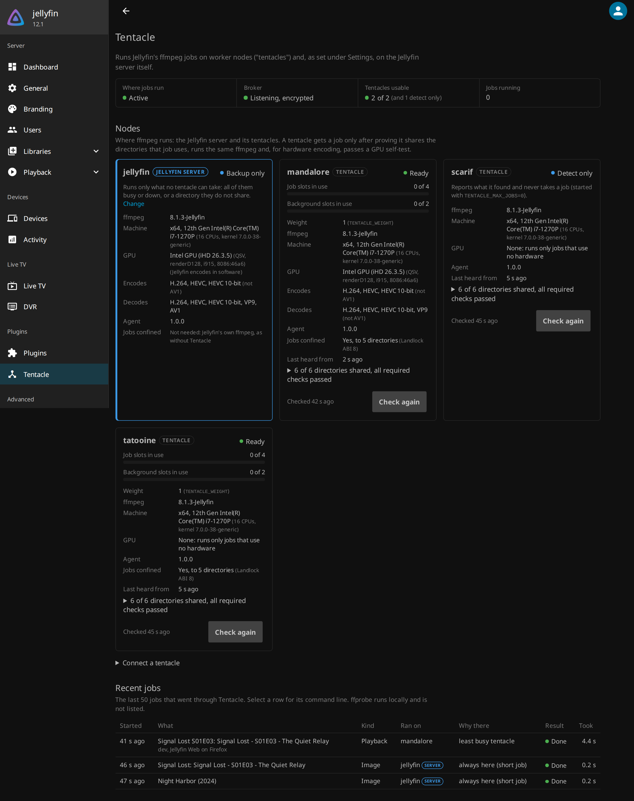

# 🐙 Tentacle 🐙

[](https://github.com/crisidev/tentacle/actions/workflows/ci.yml)
[](https://github.com/crisidev/tentacle/releases/latest)
[](https://hub.docker.com/r/crisidev/tentacle)
[](https://jellyfin.org)
[](LICENSE)

**Is your Jellyfin server melting while three other machines sit idle?**

**Blog post: [https://blog.crisidev.org/2026-10-05/](https://blog.crisidev.org/2026-10-05/)**

Tentacle spreads [Jellyfin](https://jellyfin.org)'s transcoding across your machines.
A plugin sends every ffmpeg job Jellyfin starts (playback transcodes, subtitle
extraction, trickplay, audio analysis) to worker machines called **tentacles**, or runs
it on the server, whichever is better at that moment. Tentacles connect to the server
on their own: no ssh, no shared database, no state that can go stale.

It is a replacement for [rffmpeg](https://github.com/joshuaboniface/rffmpeg), with a
dashboard, metrics, and checks that each tentacle can really run a job before it gets
one.



* [Features](#features)
* [Limitations](#limitations)
* [Getting started](#getting-started)
* [Tentacle and rffmpeg](#tentacle-and-rffmpeg)
* [Roadmap](#roadmap)
* [Documentation](#documentation)
* [Thanks](#thanks)

## Features

* **Every kind of ffmpeg job**: playback transcodes, subtitle and attachment
  extraction, trickplay, audio analysis. Quick probes stay on the server.
* **Proven, not assumed.** Each tentacle proves it sees the same files as the server,
  runs the same ffmpeg, and can use its GPU before it gets a job, and proves it again
  every 10 minutes.
* **Sends work where there is room**, keeping slots free for playback so background
  jobs like trickplay never get in its way.
* **The server can join in**: as a backup, as one more worker, or never.
* **Nothing gets stuck.** Stop playback, kill a tentacle, unplug a machine: its jobs end
  with it, and Jellyfin starts the transcode again elsewhere within seconds.
* **Fails safe.** If anything is in doubt, the job runs on the server, just as without
  Tentacle.
* **Knows your GPUs.** Each tentacle finds its Intel, AMD or NVIDIA GPUs and measures
  what they can encode and decode.
* **A dashboard page** in Jellyfin shows every tentacle, its checks, and every job with
  where it ran and why. Prometheus metrics, alerts and a Grafana board come with it.
* **Secure by default**: encrypted connections, a token you can rotate, and jobs locked
  to the shared folders on each tentacle.
* **Easy to add**: the server is just a Jellyfin plugin, installed from its repository
  in any Jellyfin 10.11 or 12.1+ on Linux (official image, LinuxServer, distro packages). Each
  tentacle is the [LinuxServer](https://www.linuxserver.io/) Jellyfin image with one
  docker mod, for amd64 and arm64. Uninstall the plugin and Jellyfin is back to normal.

## Limitations

* **Your media and Jellyfin's working folders must be on shared storage (NFS, SMB,
  CephFS...), mounted at exactly the same paths on the server and on every tentacle.**
  Tentacle checks this and only sends a tentacle the jobs whose files it can see.
* Jellyfin **10.11** or **12.1 and later** on Linux only.
* Every tentacle needs the **same ffmpeg as the server**: run the LinuxServer image of
  the same Jellyfin version as the server (it ships the same jellyfin-ffmpeg).
* Tentacles run the **LinuxServer image** (or `tentacle agent` by hand); only the server
  is free to be any Jellyfin install.
* **Hardware transcodes need a GPU of the same vendor as the server's** (Intel with
  Intel, NVIDIA with NVIDIA). Tentacles with another GPU, or none, still take
  everything else: remuxes, audio, subtitles, software encodes.
* Hardware transcoding is tested on Intel (QSV and VAAPI). AMD and NVIDIA are detected
  but not yet tested for real jobs; reports are very welcome.

## Getting started

You need Jellyfin 10.11 or 12.1+ on Linux and **shared storage that every machine mounts at the
same paths**.

1. **On the server**, add the plugin repository in **Dashboard → Plugins →
   Repositories** (any name, e.g. `Tentacle`):

   ```
   https://github.com/crisidev/tentacle/releases/latest/download/manifest.json
   ```

   install **Tentacle** from the catalog, and restart Jellyfin. The repository has a
   build for 12.1+ and one for 10.11: Jellyfin picks the one it can run. Open port 8097 for the
   tentacles, and point `TMPDIR` at a shared folder (trickplay writes there):

   ```yaml
   environment:
     TMPDIR: /config/cache/temp
   ports:
     - 8097:8097
   ```

   The plugin puts its ffmpeg stand-in in front of Jellyfin's on its own. To use
   Jellyfin's supported setting instead, set `JELLYFIN_FFMPEG` (`FFMPEG_PATH` in the
   LinuxServer image) to the path the dashboard shows
   ([why](docs/installation.md#how-jellyfin-runs-the-shim)).

2. Open **Dashboard → Tentacle** and expand **Connect a tentacle**. It shows the token,
   the certificate fingerprint and the settings to give each tentacle.

3. **On each tentacle machine**, run the LinuxServer Jellyfin image of the same version
   with the worker mod, the same shared folders at the same paths, and those settings:

   ```yaml
   environment:
     DOCKER_MODS: crisidev/tentacle:worker-2.0.0
     TENTACLE_BROKER_URL: wss://jellyfin.lan:8097
     TENTACLE_BROKER_FINGERPRINT: "AB:CD:...:EF"
     TENTACLE_TOKEN_FILE: /run/secrets/tentacle-token
     TENTACLE_ROOTS: /data/media:/config/cache/transcodes:/config/cache/temp:/config/data/data/subtitles:/config/data/data/attachments
   devices:
     - /dev/dri:/dev/dri             # optional: its GPU
   ```

4. The tentacle appears on the dashboard and turns **Ready** once its checks pass.
   Tentacle starts in **Shadow** mode, where everything still runs on the server and the
   dashboard shows where each job *would* have gone. When that looks right, set **Where
   jobs run** to **Active** and press play.

Complete files: [Docker Compose](examples/compose/) and [Kubernetes](examples/kubernetes/).
Every setting is described in [docs/configuration.md](docs/configuration.md).

## Tentacle and rffmpeg

| | rffmpeg | Tentacle |
|---|---|---|
| How jobs travel | ssh, one session per job | one encrypted WebSocket per job |
| State | a database on shared storage; killed jobs leave rows behind | none: a job ends with its connections |
| Worker health | not tracked | registration, heartbeats, drain on shutdown, cooldown after failures |
| Checks before a job | none | shared folders, ffmpeg version, GPU self-test |
| Choosing a worker | fewest running jobs, by host weight | least load by weight and job cost, background slots, GPU vendor |
| Visibility | none | dashboard page, Prometheus metrics, alerts, Grafana board |
| On the worker, a job can touch | anything the ssh user can | only the shared folders |
| Setup | ssh keys, a config file, a database | a plugin, a `DOCKER_MODS` per worker, and a token |

## Roadmap

✅ done 🕖 in progress 🌍 future

* ✅ Playback transcodes, extraction, trickplay and analysis on tentacles
* ✅ Shared-folder, ffmpeg and GPU checks
* ✅ Dashboard page, metrics, alerts, Grafana board
* ✅ Encryption, token rotation, jobs locked to the shared folders
* ✅ GPU detection, one tentacle per GPU, arm64
* ✅ The server as a backup, a worker, or neither
* 🌍 Hardware transcodes on any GPU vendor: Jellyfin builds each job for the GPU that
  runs it ([the plan](docs/architecture.md#not-done-yet-other-gpu-vendors-for-hardware-jobs))
* ✅ A Jellyfin plugin repository: the server needs no mod
* 🌍 Worker weights measured automatically

## Documentation

* [Installation](docs/installation.md): the plugin, Docker Compose, Kubernetes,
  without the LinuxServer image, shadow mode, uninstalling
* [Configuration](docs/configuration.md): every setting, shared folders, what runs
  where, GPUs
* [Observability](docs/observability.md): metrics, logs, alerts, Grafana
* [Security](docs/security.md): how tentacles and jobs are protected
* [Troubleshooting](docs/troubleshooting.md): why a job ran where it did
* [Architecture](docs/architecture.md): how it works inside
* [Contributing](CONTRIBUTING.md) and the [changelog](CHANGELOG.md)

## Thanks

* [Jellyfin](https://jellyfin.org), the free media server this is all for, and its
  [plugin template](https://github.com/jellyfin/jellyfin-plugin-template), which
  Tentacle started from.
* [rffmpeg](https://github.com/joshuaboniface/rffmpeg) by Joshua Boniface, which proved
  remote transcoding for Jellyfin could work and served many setups for years. Tentacle
  would not exist without it, and its lessons shaped this design.
* [LinuxServer.io](https://www.linuxserver.io/) for the Jellyfin image and the docker
  mods system the tentacles are delivered through.

## License

[GPL-3.0](LICENSE), like the Jellyfin plugin template it is derived from.
