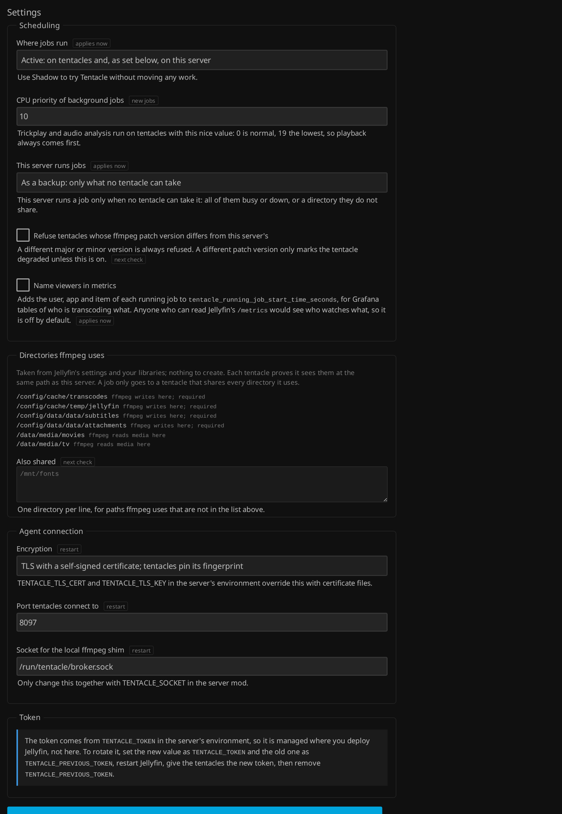

# Configuration

## Plugin settings

Dashboard → Tentacle. Each setting says when it applies (now, for new jobs, at the next
check, or after a restart).

| Setting | Default | |
|---|---|---|
| Where jobs run | Shadow | `Active`, `Shadow` (run here, record where jobs would have gone) or `Off`. |
| CPU priority of background jobs | 10 | The nice value trickplay and analysis run with on tentacles (0-19). |
| This server runs jobs | As a backup | **As a backup**: only what no tentacle can take. **As a worker**: competes with the tentacles by load, with its own slots and weight. **Never when a tentacle could**: a job no tentacle can take waits up to 10 s for one, then fails. |
| Refuse tentacles whose ffmpeg patch version differs | off | A different major.minor is always refused; a different patch only degrades the tentacle unless this is on. |
| Name viewers in metrics | off | Adds user, app and item labels to `tentacle_running_job_start_time_seconds`. Anyone who can read `/metrics` would see who watches what. |
| Also shared | | Extra directories ffmpeg uses that Tentacle cannot derive from Jellyfin's settings (fonts, for example). |
| Encryption | Self-signed | TLS with a self-signed certificate, TLS with your certificate files, or none. |
| Port tentacles connect to | 8097 | |
| Socket for the local ffmpeg shim | `/run/tentacle/broker.sock` | Only together with `TENTACLE_SOCKET`. |
| Token | generated | Replace it with an overlap, or set `TENTACLE_TOKEN`. See [Security](security.md). |

## Server environment

| Variable | Default | |
|---|---|---|
| `TENTACLE_TOKEN` | | The agents' token. Overrides (and disables) the one in the plugin settings. |
| `TENTACLE_PREVIOUS_TOKEN` | | Still accepted while set: the overlap for rotating `TENTACLE_TOKEN`. |
| `TENTACLE_NODE_NAME` | hostname | How the server is named on the dashboard and in metrics. |
| `TENTACLE_TLS_CERT`, `TENTACLE_TLS_KEY` | | Serve this certificate (PEM, or `.pfx`) instead of the self-signed one. Reloaded when the files change. |
| `TENTACLE_INSTALL_PLUGIN` | `true` | Server mod: install the bundled plugin. |
| `TENTACLE_SOCKET` | `/run/tentacle/broker.sock` | The shim's socket. |
| `TENTACLE_REAL_DIR` | `/usr/lib/jellyfin-ffmpeg` | Where the real ffmpeg and ffprobe are. |
| `TENTACLE_DISABLE` | | `1`: the shim always runs the real ffmpeg, without asking the broker. |
| `TENTACLE_DEBUG` | | `1`: the shim logs its decisions to ffmpeg's stderr (Jellyfin's FFmpeg logs). |
| `TMPDIR` | `/tmp` | Not Tentacle's, but set it to a shared directory: Jellyfin writes trickplay and image extraction under `$TMPDIR/jellyfin`. |

## Tentacle environment

| Variable | Default | |
|---|---|---|
| `TENTACLE_BROKER_URL` | | **Required.** `wss://<server>:8097`. |
| `TENTACLE_BROKER_FINGERPRINT` | | SHA-256 of the server's certificate (from the dashboard; colons and case ignored). |
| `TENTACLE_CA_FILE` | | Trust a CA instead of pinning (with your own certificate). Chain and host name are checked. |
| `TENTACLE_TOKEN` / `TENTACLE_TOKEN_FILE` | | **Required**, one of them. The file is re-read on every reconnect. |
| `TENTACLE_NODE_NAME` | hostname | The tentacle's name. With several GPUs, each is `<name>/renderD129`... |
| `TENTACLE_ROOTS` | | Directories jobs may use, separated by `:`. Jobs are confined to them with Landlock. Strongly recommended; see [Security](security.md). |
| `TENTACLE_MAX_JOBS` | 4 | Job slots (a transcode costs 1, extraction 0.25, background 0.5). `0`: detect only, the tentacle registers and shows its hardware but never takes a job. |
| `TENTACLE_MAX_BACKGROUND_JOBS` | half of max | Slots trickplay and analysis may use. |
| `TENTACLE_WEIGHT` | 1 | Relative capacity: 2 takes twice the load before losing placements. |
| `TENTACLE_GPUS` | `auto` | `auto`: one tentacle per GPU found. `none`: one CPU tentacle. Or render nodes separated by commas. |
| `TENTACLE_DRAIN_SECONDS` | 20 | On SIGTERM, how long running jobs get. Give the container a longer stop grace period and set `S6_SERVICES_GRACETIME` above it. |
| `TENTACLE_ALLOW_PLAIN_WS` | | `true` to allow a `ws://` URL (the token then crosses the network in cleartext). Never with a fingerprint or CA file. |
| `TENTACLE_REAL_DIR` | `/usr/lib/jellyfin-ffmpeg` | Where the real ffmpeg is. |

`tentacle agent-status` exits 0 once the agent is registered: use it as the readiness
probe or health check.

## Shared directories

Jellyfin hands ffmpeg absolute paths, so a tentacle must see the same file at the same
path. Tentacle derives the list from Jellyfin's settings and libraries and shows it
under **Directories ffmpeg uses**:

| Directory (LinuxServer image) | | |
|---|---|---|
| `/config/cache/transcodes` | Jellyfin's transcode path | written, required |
| `$TMPDIR/jellyfin` | trickplay, images (set `TMPDIR=/config/cache/temp`) | written, required |
| `/config/data/data/subtitles` | extracted subtitles | written, required |
| `/config/data/data/attachments` | attachments, burn-in fonts | written, required |
| `/config/cache/concat` | concat lists (when it exists) | written |
| your library folders | the media | read |
| fallback font, Live TV recordings, "Also shared" | when configured | read |

A tentacle missing a required directory is **Degraded**: it only gets jobs whose paths
it proved. A job touching a path no tentacle shares runs on the server, with the reason
`path-ineligible:<path>`.

For NFS, mount with `lookupcache=positive,actimeo=1` (or similar) so files one side
writes show up quickly on the other.

## What runs where

| Job | Where | Class | Cost |
|---|---|---|---|
| Playback transcode | tentacle preferred | interactive | 1 |
| Subtitle and attachment extraction | anywhere | interactive | 0.25 |
| Trickplay, audio analysis | tentacle preferred | background | 0.5 |
| ffprobe, single images, info queries | always the server | | |

A job goes to the node with the lowest `(load + cost) / weight` among those that proved
every path it uses and, if it uses hardware, have a GPU of the right vendor that passed
the self-test. Background jobs are capped per node and run at the background nice
value. There is no queue: if every tentacle is full, the server takes the job (unless
it is set to never run jobs).

Tentacle states: **Verifying**, **Ready**, **Degraded** (a required check failed; still
used where it can be), **Incompatible** (different ffmpeg), **Draining**,
**CoolingDown** (3 infrastructure failures in a row: 1 minute, doubling up to 15),
**DetectOnly**.

## The server's share

The dashboard shows the Jellyfin server as a node next to the tentacles, with its GPU's
measured capabilities. **This server runs jobs** decides its role:

* **As a backup** (default): only what no tentacle can take right now.
* **As a worker**: it gets slots and a weight, and competes with the tentacles by load.
  Background jobs get at most half its slots.
* **Never** (when a tentacle could): a job no tentacle can take waits up to 10 s for
  one, then is refused. Jellyfin reports a playback error. Jobs that only the server can
  run (probes, single images) still run.

## GPUs

Each agent finds its GPUs (`/sys/class/drm`: vendor, PCI id, driver, model) and
measures each with one-second hardware encodes (H.264, HEVC, HEVC 10-bit, AV1) and
decodes (also VP9). It registers one tentacle per GPU, named after the host when there
is one and `host/renderD129` when there are several, and points each job at its own
render node. A host without a usable GPU registers one CPU tentacle. Raspberry Pis name
their board.

Because Jellyfin builds each command line for its own hardware type:

* the server's GPU self-test only runs on tentacles with a GPU of the server's vendor
  (QSV: Intel, NVENC: NVIDIA, VAAPI: the server's device). The others skip it, stay
  Ready, and take jobs that use no hardware;
* a hardware job only goes to a tentacle that passed the self-test and whose GPU is the
  vendor the command line names (`h264_qsv`, `driver=iHD`, `cuda`...).

`TENTACLE_MAX_JOBS=0` makes a detect-only tentacle: a cheap way to see what a machine's
GPU can do, from the dashboard, without giving it any work.
